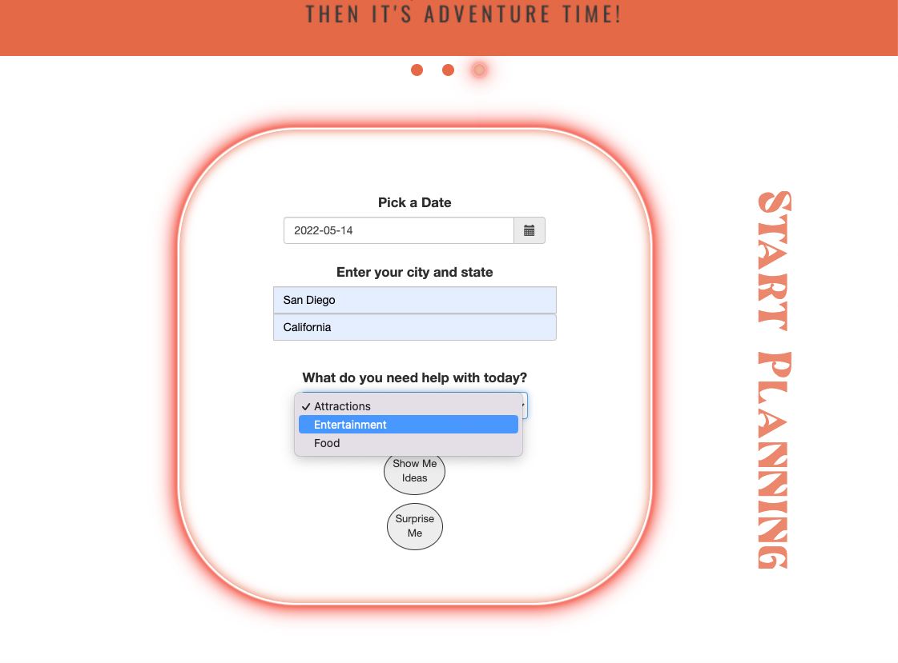

# Great Date
Indecisive date night application
Live demo [_here_](https://haleyhilton.github.io/No-Clue-What-To-Do/)

Table of Contents
* [General Info](#general-information)
* [Features](#features)
* [Screenshots](#screenshots)
* [Project Status](#project-status)
* [Room for Improvement](#room-for-improvement)
* [Acknowledgements](#acknowledgements)
* [Contact](#contact)

## General Information
- Great Date is an application / website that can be used romantically or platonically as a catalyst for a "great date." So often we are paralyzed by the inability to choose or are too tired to even know where to start. Great Date solves this by only asking the user for three parameters in order to generate "great date" ideas:
* 1 Date (the date you'd like suggestions for)
* 2 Location (can be local or where you'd like visit)
* 3 Activity (Food, Attractions or Entertainment) 

## Features
* HTML
* CSS
* jQuery
* Bootstrap
* Server-side APIs
* Git branching workflow

## Screenshots

A user can expect to first pick a date, then enter a city and state (San Diego and California will act as placeholders as that is the home city of the app contributors). Lastly, the user is asked to choose between three options to get help with (Attractions, Entertainment or Food). The user can then hit Show Me Ideas and see their results given the parameters they outlined. If the user hits Surprise Me, they are given a random suggestion.

## Project Status
Project is: _in progress_ 

## Room for Improvement
- Eliminating suggestions that do not meet the criteria for a great date (attractions and food that are not ideal) 
- Click through Option (Direct users directly to Google or Yelp for directions and further info)

To do:
- Full Package Date (Give a fully random assortment / packaged date idea that includes attractions, entertainment and food suggestions)
- User Controls (Control features using radius toggle, place further parameters to narrow down results - accounting for food preferences, allergies, types of entertainment etc.)
- Add to calendar feature 

## Acknowledgements
Thank you to the UCSD Bootcamp instructors and TAs for their direction and assistance deploying our first group project and using working branches.

## Contact
Created by Haley Hilton Zito, David Rios, David Ryan and Jerry Trueba - feel free to contact us!
